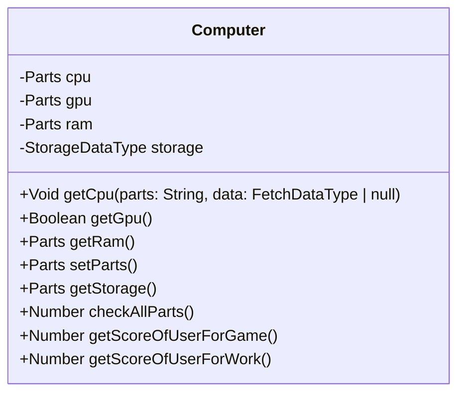

# コンピュータの組み立てアプリケーション


4つのパーツ(CPU / GPU / メモリ / ストレージ)の種類を選択し、「仮想のコンピュータ」を組み立て、その性能を評価し比較するアプリケーションです。

<a href="https://computer-builder-beta.vercel.app">アプリケーションを使用してみる</a>

## プロジェクトの目的

Recursionでは、`API`、`サーバー`についてその仕組みを理解し、`fetch`関数、`Promise`オブジェクト、`JSON`を使って情報を取得する方法をインプットしました。

アプトプットとして、コンピュータのパーツ情報を提供する API を利用し、コンピュータを組み立て、組み立てたコンピュータのスコアを表示するアプリケーションを作成することが目的です。

## 技術的な側面
    
このプロジェクトでは以下の技術スタックを採用しました。

### OOP（オブジェクト指向プログラミング）

OOPを採用した理由は以下のメリットがあったためです。

- データとそれに関連する機能がまとまっているため、変更を行う際に影響範囲を把握しやすい
- 現実世界の概念に基づいてコードを構造化できるため、理解しやすい
- コードの再利用性や保守性が向上するため、開発時間を削減できる

今回はコンピュータを構造化するために以下のように行いました。



### MVCアーキテクチャ
### TypeScript
### Tailwind CSS
### Vite
### Vercel

## 問題解決と工夫

プロジェクトにおける具体的な課題や難点に対するアプローチや工夫、解決策を説明します。

### （1）APIを使用して各パーツ情報の取得

以下のように、`fetch`関数を使用して、非同期で`API`のエンドポイントに`GETリクエスト`を送信し、レスポンスとして取得した`JSON`データを、`json`メソッドを使用することで解析してデータを使用しました。

例) cpuのデータ取得
```
const cpuData = fetch(url)
  .then(response => response.json())
  .then((data) => {
    for(let cpu of data){
      console.log(cpu)
    }
  })
```

各パーツの選択肢によって、表示される次の選択肢が動的に変化する用になっていますが、最初はこれを選択肢が変化する度にデータを取得して表示していました。

しかし、データ自体は変化することがないため、使い回すことが可能です。

そこで、取得したデータは、変数に格納しました。

格納したデータからソートや検索などを行うことで、余分なフェッチを削減しました。

### （2）interfaceの拡張

コンピュータが持っているデータはCPU, GPU, RAMは同一の型ですが、StorageのみHDDかSSDかを区別するためにtypeというデータをもっています。

CPU, GPU, RAMの場合）
```
brand: brandName
model: modelName
```

Storageの場合）
```
type: storageType
brand: brandName
model: modelName
```

そこで、Partsという継承元のinterfaceを作成して
各パーツでPartsのinterfaceを継承しました。

パーツ
```
interface Parts {
  brand: string
  model: string
}

interface Storage extends Parts {
  type: string
}
```

## コードの品質と構造
    
コードの品質についての考え方や重要視する点、プロジェクトのディレクトリ構造やコーディングスタイルについて説明します。

このプロジェクトではオブジェクト指向プログラミングのデザインパターンとしてMVCアーキテクチャを採用しています。

これを採用したことで開発速度の向上と安全なデータの操作が行えています。

コーディングは静的なViewの実装から取り掛かり、Model、Controller、動的なViewの実装という順番で進めていきました。

ディレクトリや各ディレクトリの役割は以下のようにしました。

- config : 設定ファイル
- interface : オブジェクトの型の指定
- model : コンピュータのデータを定義
- controller : modelとviewの操作を定義
- view : 画面に表示するdomを定義

## 学びと成長
    
このプロジェクトを通して以下のような学びや成長がありました。

- MVCアーキテクチャを用いた設計を行えるようになった
- OOPの型の指定がスムーズに行えるようになった
- APIからデータを取得して、処理を実装できるようになった

## 今後の展望
    
このプロジェクトのように、TypeScriptのみの環境下でAPIが使用されるケースは少ないと考えており、今後はReactやNext.jsなどのモダンなライブラリやフレームワークの環境下でのAPIの使用にも慣れていきたいです。

## 参考文献

- https://developer.mozilla.org/ja/docs/Web/API/Fetch_API/Using_Fetch
